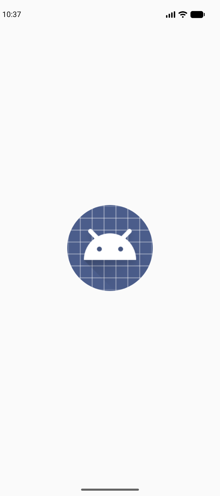

# Experiment 1: Hello World Android Application

## Description
This experiment involves developing a fundamental "Hello World" Android application to understand the basic structure of an Android project and the use of Jetpack Compose for UI development.

## Concept & Technology
- **Android Studio**: The primary IDE for Android development.
- **Kotlin**: The modern, statically-typed programming language used for Android apps.
- **Jetpack Compose**: Android's modern toolkit for building native UI using a declarative approach.
- **Activity**: A single, focused thing that the user can do (the entry point of the app).

## Scenario
The application is designed to display a centered text message on the screen. It demonstrates the ability to modify the displayed content and verify the output through multiple test cases, including personal identification details.

## Project Structure
```text
Exp-1/
├── app/
│   ├── src/
│   │   ├── main/
│   │   │   ├── java/com/example/helloworld/
│   │   │   │   └── MainActivity.kt (Main UI Logic)
│   │   │   └── AndroidManifest.xml (App Configuration)
│   ├── build.gradle.kts (Module Build Script)
├── screenshots/
│   ├── tc1.png (Siddhi Assudani USN: 25MCAR0199)
│   ├── tc2.png (HelloWorld)
│   └── tc3.png (Welcome to MAD Lab - Experiment 1)
├── build.gradle.kts (Root Build Script)
└── settings.gradle.kts (Project Settings)
```

## Test Cases & Screenshots

### Test Case 1: Personal Details
- **Input**: "Siddhi Assudani USN: 25MCAR0199"
- **Expected Output**: The screen displays the user's name and USN centered.
- **Result**: Pass


### Test Case 2: Hello World
- **Input**: "HelloWorld"
- **Expected Output**: The screen displays "HelloWorld" centered.
- **Result**: Pass


### Test Case 3: Custom Message
- **Input**: "Welcome to MAD Lab - Experiment 1"
- **Expected Output**: The screen displays the custom welcoming message centered.
- **Result**: Pass

