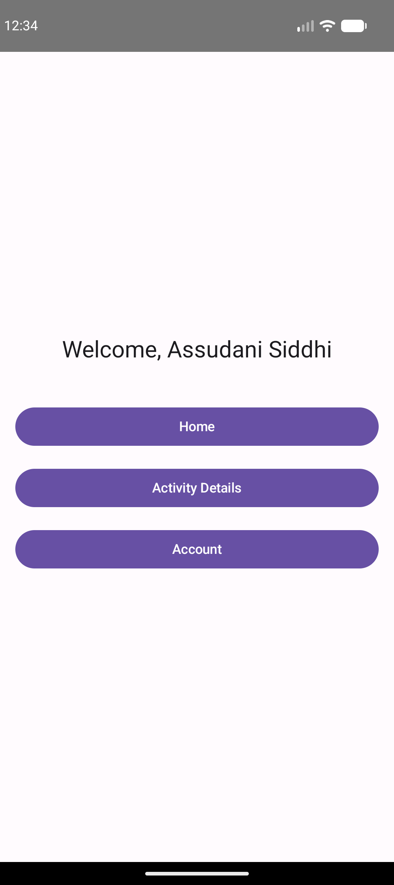
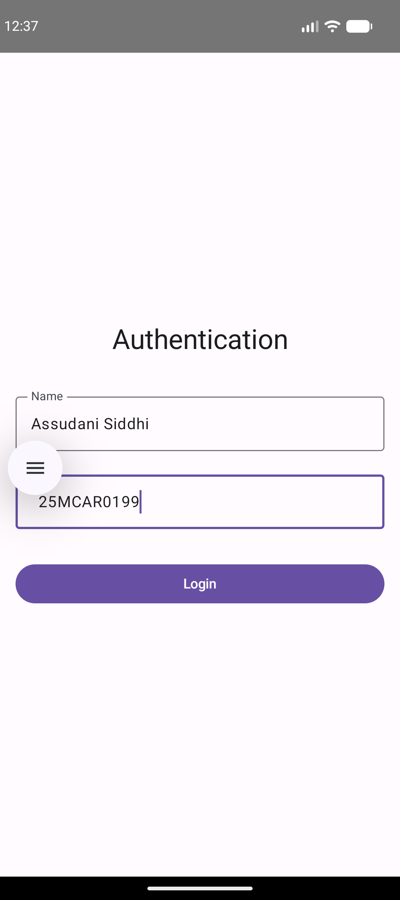
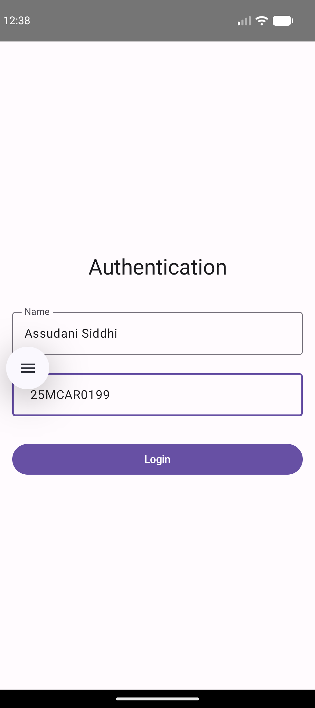

# Experiment 2: Activity Lifecycle Application

## Description
This experiment demonstrates the **Activity Lifecycle** in Android. By implementing various lifecycle callback methods, we can observe how an Activity transitions through different states (Created, Started, Resumed, Paused, Stopped, Destroyed).

## Concept & Technology
- **Activity Lifecycle**: The set of states an activity can be in, managed by the Android system via callback methods like `onCreate`, `onStart`, `onResume`, etc.
- **Intents**: Used to navigate between activities and pass data (Name and USN).
- **Jetpack Compose**: Used for building a modern and responsive UI.
- **Material 3**: The latest version of Google's open-source design system.

## Project Structure
```text
Exp-2/
├── app/
│   ├── src/
│   │   ├── main/
│   │   │   ├── java/com/example/lifecycleapp/
│   │   │   │   ├── LoginActivity.kt (Authentication)
│   │   │   │   ├── DashboardActivity.kt (Navigation)
│   │   │   │   ├── HomeActivity.kt (Home Screen)
│   │   │   │   ├── LifecycleActivity.kt (Lifecycle Tracker)
│   │   │   │   └── AccountActivity.kt (User Details)
│   │   │   └── AndroidManifest.xml (Activity Registry)
│   └── build.gradle.kts
├── screenshots/
│   ├── login.png
│   ├── dashboard.png
│   ├── lifecycle.png
│   ├── home.png
│   └── account.png
├── build.gradle.kts
└── settings.gradle.kts
```

## Features & Scenarios
1.  **Authentication**: A login screen where the user enters their Name and USN.
2.  **Dashboard**: A central hub with options to navigate to Home, Activity Details, and Account.
3.  **Lifecycle Tracker**: A dedicated screen that overrides all lifecycle methods and displays them in a list on the UI, while also showing Toasts for each state change.
4.  **Account**: Displays the data passed from the login screen.

## Test Cases & Screenshots

### Test Case 1: Authentication (Name & USN)
- **Scenario**: User enters "Assudani Siddhi" and "25MCAR0199".
- **Result**: Data is successfully captured and the user is logged in.


### Test Case 2: Dashboard Navigation
- **Scenario**: User navigates through the three options (Home, Activity Details, Account).
- **Result**: Correct activities are launched with consistent data.


### Test Case 3: Activity Lifecycle Observation
- **Scenario**: User opens "Activity Details" and performs actions like going home or rotating the screen.
- **Result**: The UI displays the sequence of lifecycle method calls (onCreate -> onStart -> onResume, etc.).


### Test Case 4: Account Details
- **Scenario**: User views their account information.
- **Result**: Displays "Name: Assudani Siddhi" and "USN: 25MCAR0199".

