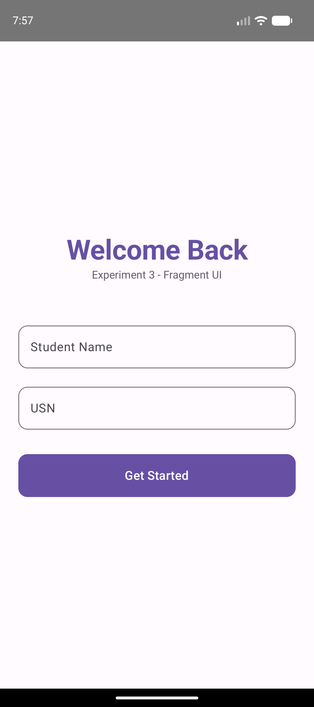
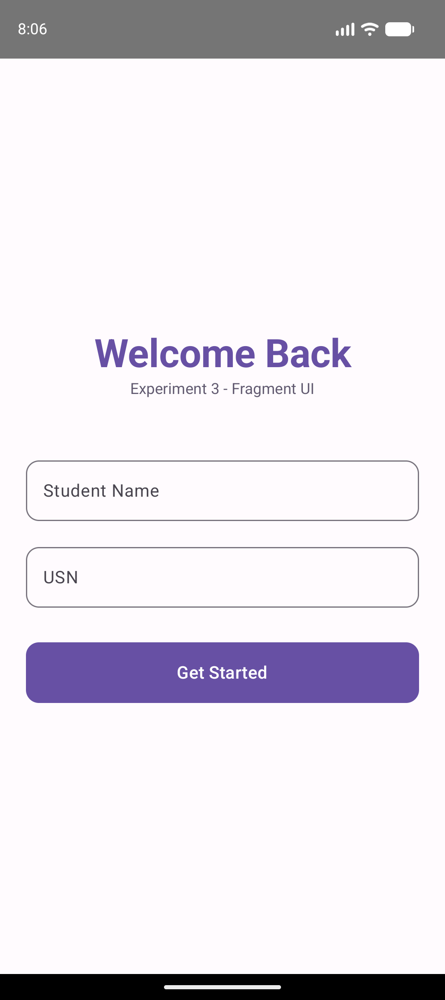

# Experiment 3: Fragment-based Flexible UI with Modern Design

## Description
This experiment demonstrates the use of **Fragments** to create a flexible and modular UI in Android. It follows a Single-Activity architecture where multiple fragments are hosted within a single activity container.

## Concept & Technology
- **Single-Activity Architecture**: One `MainActivity` handles the hosting and transition of multiple fragments.
- **Fragments**: Modular portions of an activity's user interface.
- **Jetpack Compose**: Used within Fragments (`ComposeView`) to achieve an enhanced, **modern look**.
- **Shared ViewModel**: Facilitates easy data sharing (Name, USN) between fragments.
- **Material 3**: Leverages modern UI components and styling.

## Scenario
The application starts with a modern authentication screen. Upon entering the student's name and USN, the app navigates to a Dashboard. The Dashboard provides access to "Home", "Student Details", and "Account" screens, all implemented as independent Fragments for maximum flexibility.

## Project Structure
```text
Exp-3/
├── app/
│   ├── src/
│   │   ├── main/
│   │   │   ├── java/com/example/fragmentapp/
│   │   │   │   ├── MainActivity.kt (Fragment Host)
│   │   │   │   ├── UserViewModel.kt (Shared Data)
│   │   │   │   └── ui/
│   │   │   │       ├── LoginFragment.kt
│   │   │   │       ├── DashboardFragment.kt
│   │   │   │       ├── HomeFragment.kt
│   │   │   │       ├── StudentDetailsFragment.kt
│   │   │   │       └── AccountFragment.kt
│   │   │   └── AndroidManifest.xml
│   └── build.gradle.kts
├── screenshots/
│   ├── login.png
│   ├── dashboard.png
│   └── student_details.png
├── build.gradle.kts
└── settings.gradle.kts
```

## Features & Scenarios
1.  **Modern Authentication**: A sleek login screen using Material 3 text fields and rounded buttons.
2.  **Flexible Dashboard**: Replaced "Activity Details" with **"Student Details"** for better context. Uses tonal buttons with icons.
3.  **Fragment Navigation**: Smooth transitions between UI modules without restarting the activity.
4.  **Student Details**: A dedicated card-based view to display the student's profile information.

## Test Cases & Screenshots

### Test Case 1: Modern Auth (Login)
- **Scenario**: User enters "Assudani Siddhi" and "25MCAR0199".
- **Result**: Data is stored in the Shared ViewModel and the app navigates to the Dashboard.


### Test Case 2: Modern Dashboard
- **Scenario**: Navigation options are displayed with a modern aesthetic, including the "Student Details" option.
- **Result**: Responsive layout with tonal buttons.


### Test Case 3: Student Details (Data Passing)
- **Scenario**: User clicks on "Student Details".
- **Result**: The fragment retrieves and displays the correct data from the Shared ViewModel within a modern Card component.

