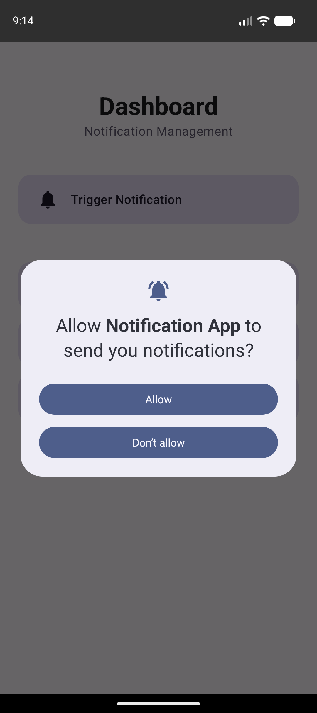
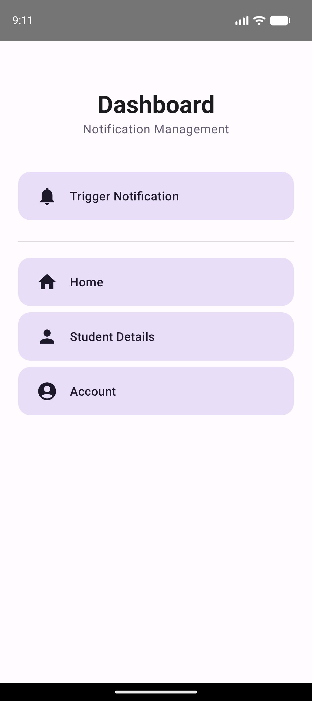

# Experiment 5: Notifications in Android

## Description
This experiment demonstrates the development of an Android application for displaying notifications. It covers the creation of notification channels and the delivery of system-level alerts to the user.

## Concept & Technology
- **Notification Manager**: The system service used to manage notifications.
- **Notification Channels**: Required for Android 8.0 (API 26) and above to group and manage notifications.
- **Runtime Permissions**: Handling `POST_NOTIFICATIONS` permission for Android 13 (API 33) and above.
- **Jetpack Compose**: Modern UI implementation for the dashboard and interaction triggers.

## Scenario
The application includes an authentication flow. Once logged in, the Dashboard provides a "Trigger Notification" button. When clicked, it checks for permissions and displays a system tray notification containing a personalized greeting with the student's name.

## Project Structure
```text
Exp-5/
├── app/
│   ├── src/
│   │   ├── main/
│   │   │   ├── java/com/example/notificationapp/
│   │   │   │   ├── LoginActivity.kt
│   │   │   │   ├── DashboardActivity.kt (Notification logic)
│   │   │   │   ├── NotificationHelper.kt (Channel management)
│   │   │   │   ├── HomeActivity.kt
│   │   │   │   ├── StudentDetailsActivity.kt
│   │   │   │   └── AccountActivity.kt
│   │   │   └── AndroidManifest.xml (Notification permissions)
│   └── build.gradle.kts
├── screenshots/
│   ├── login.png
│   ├── dashboard.png
│   └── student_details.png
├── build.gradle.kts
└── settings.gradle.kts
```

## Features & Scenarios
1.  **Authentication**: Securely entering student details.
2.  **Notification Trigger**: A dedicated button to launch a system alert.
3.  **Permission Management**: Proper handling of Android 13+ notification permissions.
4.  **Modern UI**: Tonal buttons and Material 3 cards for a professional look.

## Test Cases & Screenshots

### Test Case 1: Notification Authorization
- **Scenario**: User clicks "Trigger Notification".
- **Result**: App requests permission (if needed) and displays the Dashboard hub.


### Test Case 2: Data Integrity
- **Scenario**: Verify Name and USN are still correctly passed through activities.
- **Result**: Data is accurately displayed on the Student Profile screen.


### Test Case 3: App Entry
- **Scenario**: Initial login screen with Name and USN fields.
- **Result**: Modern UI ready for input.

