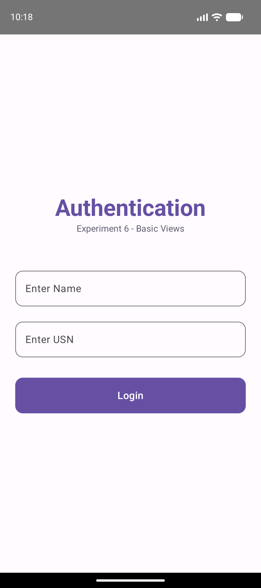
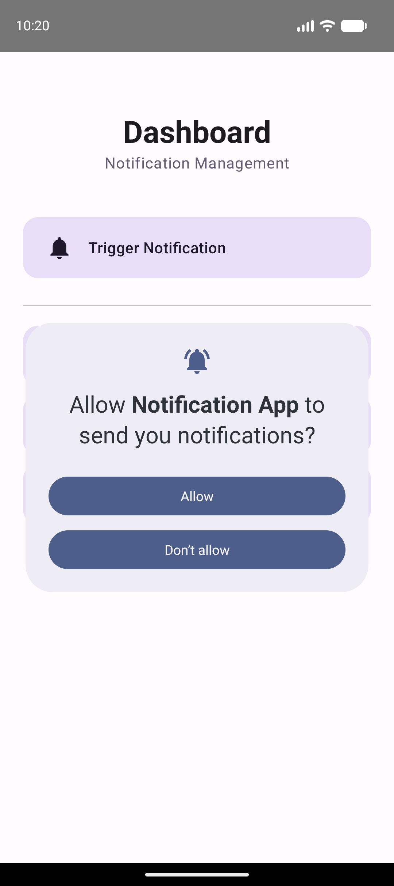

# Experiment 6: Basic Android Views Showcase

## Description
This experiment demonstrates the implementation of fundamental Android UI components, often referred to as "Basic Views". It provides a comprehensive showcase of elements used for data entry, selection, and interaction.

## Concept & Technology
- **TextView**: Used for displaying static or dynamic text.
- **EditText**: Allows users to enter and edit text (implemented as `OutlinedTextField` in Compose).
- **Button**: A standard interactive element for triggering actions.
- **ImageButton**: A button that displays an icon/image (`IconButton` in Compose).
- **CheckBox**: Allows selecting one or more items from a set.
- **ToggleButton/Switch**: A control that can be toggled between two states.
- **RadioButton & RadioGroup**: Enables selecting a single option from a predefined group.

## Scenario
The application features a "Student Survey Form" that utilizes all the above views. Users can provide a bio, select their interests, toggle app notifications, and choose their department. This form is accessed from a central dashboard that also maintains the notification and authentication features from previous experiments.

## Project Structure
```text
Exp-6/
├── app/
│   ├── src/
│   │   ├── main/
│   │   │   ├── java/com/example/basicviewsapp/
│   │   │   │   ├── LoginActivity.kt
│   │   │   │   ├── DashboardActivity.kt
│   │   │   │   ├── BasicViewsActivity.kt (Showcase Form)
│   │   │   │   ├── NotificationHelper.kt
│   │   │   │   ├── HomeActivity.kt
│   │   │   │   ├── StudentDetailsActivity.kt
│   │   │   │   └── AccountActivity.kt
│   │   │   └── AndroidManifest.xml
│   └── build.gradle.kts
├── screenshots/
│   ├── dashboard.png
│   ├── showcase.png
│   └── student_details.png
├── build.gradle.kts
└── settings.gradle.kts
```

## Test Cases & Screenshots

### Test Case 1: Views Showcase (Form)
- **Scenario**: Navigate to the "Basic Views Showcase" and interact with the form elements.
- **Result**: All views (EditText, CheckBox, Switch, RadioButtons) respond correctly to user input.


### Test Case 2: Dashboard Navigation
- **Scenario**: Access the updated dashboard with the new showcase entry point.
- **Result**: Modern UI with clear navigation paths.


### Test Case 3: Integrated Functionality
- **Scenario**: Verify that student details (Name/USN) are still correctly handled while exploring new views.
- **Result**: Data persistence verified across activity transitions.

