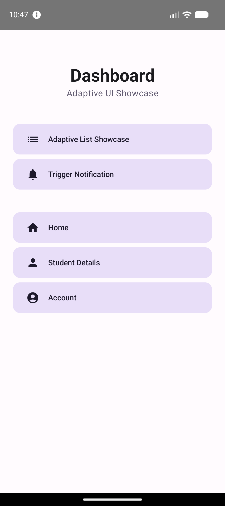
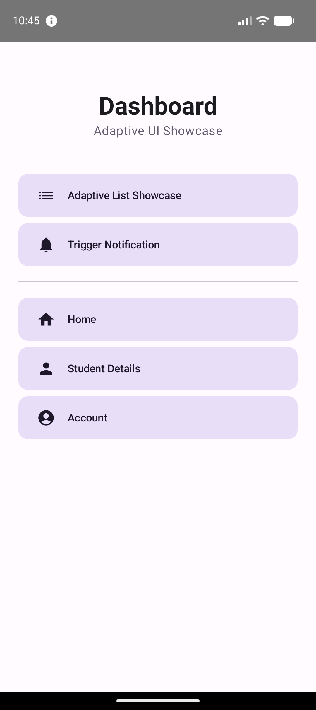
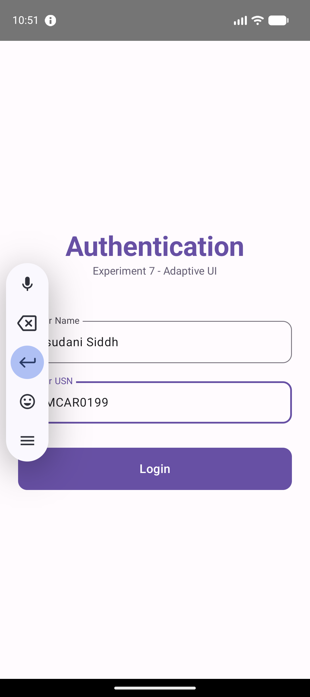

# Experiment 7: Creating an Adaptive Android Application with ListView and ImageView

## Description
This experiment focuses on building an **Adaptive UI** that utilizes advanced collection views and image displays. It demonstrates how to present structured data efficiently using a list format that remains readable across different screen orientations.

## Concept & Technology
- **Adaptive UI**: Designing layouts that respond to changes in screen size and orientation.
- **LazyColumn (Modern ListView)**: The Jetpack Compose successor to `ListView`, optimized for displaying large collections of items.
- **ImageView (Icons)**: Used to provide visual context for each list item.
- **Card View**: Encapsulates list items with rounded corners and elevation for a modern, professional look.

## Scenario
The application features a "Course Curriculum List" for the MCA program. Each item in the list shows a course title, its subject code, a unique icon, and a brief description. The UI is designed to be adaptive, ensuring a high-quality user experience regardless of the device's orientation.

## Project Structure
```text
Exp-7/
├── app/
│   ├── src/
│   │   ├── main/
│   │   │   ├── java/com/example/adaptivelistapp/
│   │   │   │   ├── LoginActivity.kt
│   │   │   │   ├── DashboardActivity.kt
│   │   │   │   ├── AdaptiveListActivity.kt (Showcase List)
│   │   │   │   ├── NotificationHelper.kt
│   │   │   │   ├── HomeActivity.kt
│   │   │   │   ├── StudentDetailsActivity.kt
│   │   │   │   └── AccountActivity.kt
│   │   │   └── AndroidManifest.xml
│   └── build.gradle.kts
├── screenshots/
│   ├── dashboard.png
│   ├── list.png
│   └── student_details.png
├── build.gradle.kts
└── settings.gradle.kts
```

## Features & Scenarios
1.  **Adaptive List**: A scrollable list of academic courses with integrated images/icons.
2.  **Modern Card UI**: Items are presented in sleek Material 3 cards.
3.  **Data Persistence**: Student authentication data is preserved and accessible from the dashboard.
4.  **System Alerts**: Notification triggers remain functional from previous experiments.

## Test Cases & Screenshots

### Test Case 1: Adaptive List Showcase
- **Scenario**: Navigate to the curriculum list and scroll through items.
- **Result**: Each course is displayed with its specific icon and code in a responsive list.


### Test Case 2: Dashboard Navigation
- **Scenario**: Access the updated hub with the curriculum entry point.
- **Result**: Clear, icon-based navigation.


### Test Case 3: Identity Verification
- **Scenario**: Check the Student Profile screen.
- **Result**: Confirms "Assudani Siddhi" and "25MCAR0199" are correctly handled.

